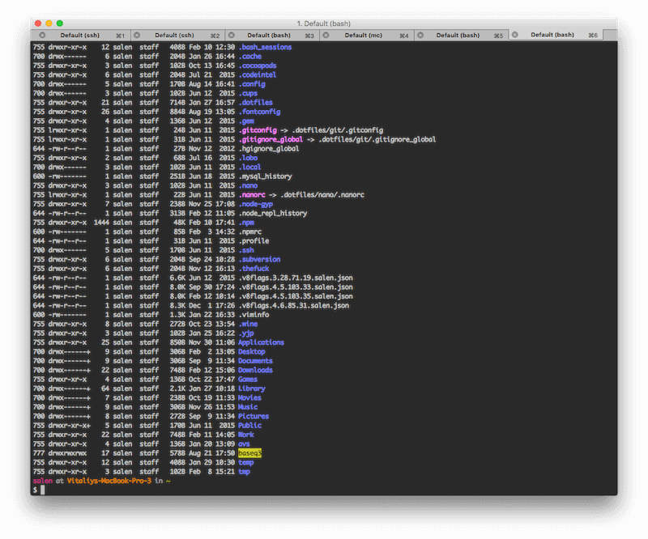

# Dotfiles
My configuration files for utilities which I'm using everyday.


## Features
* No dependencies
* Bash
 * aliases for npm, bower
 * aliases for brew
 * lock - run screensaver with password protection
 * la is for better ls - with color output and numberized chmod
 * manp - like man but in Text.app
 * ru - removes unnecessary ._* media files & DS_Store
 * extract - unzip any archive
 * h{{lang}} - hjs, hhtml, hcss - syntax highlighter for the code from buffer. Puts highlighted back to buffer
 * gc - opens google chrome with disabled web security (sometimes required for lazy development without setuping local web server)
 * some maven crappy alias
 * cool highlight of terminal output
* Homebrew
 * For packages look into [brew.txt](brew.txt)
 * For casks look into [cask.txt](cask.txt)
* Sublime
 * Settings are copied from [Preferences](sublime/Preferences.sublime-settings). Not symlink because there is a bug with that when you saving sublime settings into symlinked file.
 * Custom icon is located under [sublime](sublime) directory. For now on - change is manually
* NPM
 * Installs packages defined in [npm.txt](npm.txt) globally
* Git config and global ignore
* IntelliJ IDE exported settings
* Nano syntax highlighter
* iTerm color theme
* OS X tweaks

## Installation
```
cd ~ && git clone --recursive git://github.com/vitaliyr/dotfiles.git ~/.dotfiles && sh ~/.dotfiles/install.sh
```
* Change icon for the SublimeText
* Import settings for IntelliJ

## Packing
Because I can't link Sublime configs (weird bug - when they're linked, you can't change settings from sublime) there is a [pack.sh](pack.sh) script which generally copies sublime 
settings to working directory of dotfiles repository after what you can commit them. Also I'm put there brew 'backup'.
```
sh pack.sh
```

## Thanks
* [Paul Miller](https://github.com/paulmillr) for bootstrap and ideas
* [Gianni Chiappetta](https://github.com/gf3) for prompt

## License
The MIT License (MIT)

Copyright (c) 2015 Vitaliy Ribachenko ([http://ribachenko.com](http://ribachenko.com))

Permission is hereby granted, free of charge, to any person obtaining a copy
of this software and associated documentation files (the "Software"), to deal
in the Software without restriction, including without limitation the rights
to use, copy, modify, merge, publish, distribute, sublicense, and/or sell
copies of the Software, and to permit persons to whom the Software is
furnished to do so, subject to the following conditions:

The above copyright notice and this permission notice shall be included in all
copies or substantial portions of the Software.

THE SOFTWARE IS PROVIDED "AS IS", WITHOUT WARRANTY OF ANY KIND, EXPRESS OR
IMPLIED, INCLUDING BUT NOT LIMITED TO THE WARRANTIES OF MERCHANTABILITY,
FITNESS FOR A PARTICULAR PURPOSE AND NONINFRINGEMENT. IN NO EVENT SHALL THE
AUTHORS OR COPYRIGHT HOLDERS BE LIABLE FOR ANY CLAIM, DAMAGES OR OTHER
LIABILITY, WHETHER IN AN ACTION OF CONTRACT, TORT OR OTHERWISE, ARISING FROM,
OUT OF OR IN CONNECTION WITH THE SOFTWARE OR THE USE OR OTHER DEALINGS IN THE
SOFTWARE.
